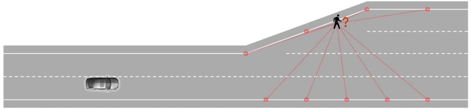
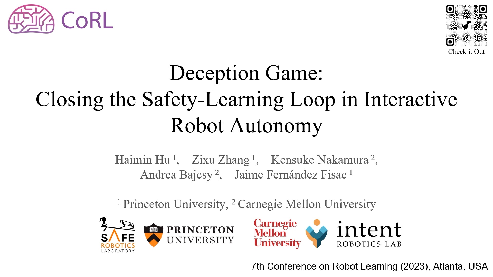

# Deception game: Closing the safety-learning loop in interactive robot autonomy

[![License][license-shield]][license-url]
[](https://www.python.org/downloads/)
[![Website][homepage-shield]][homepage-url]
[![Paper][paper-shield]][paper-url]

[Haimin Hu](https://haiminhu.org/)<sup>1</sup>,
[Zixu Zhang](https://zzx9636.github.io/)<sup>1</sup>,
[Kensuke Nakamura](https://kensukenk.github.io/),
[Andrea Bajcsy](https://www.cs.cmu.edu/~abajcsy/),
[Jaime F. Fisac](https://saferobotics.princeton.edu/jaime)

<sup>1</sup>equal contribution

Published as a conference paper at CoRL'2023.


<!-- PROJECT LOGO -->
<br />
<p align="center">
  <a href="https://github.com/SafeRoboticsLab/Deception_Game">
    
  </a>
  <p align="center">
  </p>
</p>


<!-- TABLE OF CONTENTS -->
<details open="open">
  <summary><h2 style="display: inline-block">Table of Contents</h2></summary>
  <ol>
    <li><a href="#about-the-project">About The Project</a></li>
    <li><a href="#installation">Installation</a></li>
    <li><a href="#training">Training</a></li>
    <li><a href="#closed-loop-simulation">Closed-loop Simulation</a></li>
    <li><a href="#license">License</a></li>
    <li><a href="#contact">Contact</a></li>
    <li><a href="#citation">Citation</a></li>
  </ol>
</details>


<!-- ABOUT THE PROJECT -->
## About The Project

This repository implements a general RL-based framework for approximate HJI Reachability analysis in joint physical-belief spaces.
The resulting control policies explicitly account for a robot's ability to learn and adapt at runtime.
The repository is primarily developed and maintained by [Haimin Hu](https://haiminhu.org/) and [Zixu Zhang](https://zzx9636.github.io/).

Click to watch our spotlight video:
[](https://haiminhu.org/wp-content/uploads/2024/06/deception_game.mp4)


## Installation
This repository relies on [`ISAACS`](https://github.com/SafeRoboticsLab/ISAACS). Please follow the instructions there to set up the environment.


## Training
Please follow these steps to train the control and disturbance/adversary policies.
+ Pretrain a control policy
  ```bash
  python script/bgame_intent_pretrain_ctrl.py
  ```
+ Pretrain a disturbance policy
  ```bash
  python script/bgame_intent_pretrain_dstb.py
  ```
+ Joint control-disturbance training
  ```bash
  python script/bgame_intent_isaacs.py
  ```
To train the baseline policies, replace `bgame` with `robust` and repeat the above steps.


## Closed-loop Simulation
We provide a [Notebook](https://github.com/SafeRoboticsLab/Deception_Game/blob/main/simulation.ipynb) for testing the trained policies in closed-loop simulations and comparing with baselines.


<!-- LICENSE -->
## License

Distributed under the MIT License. See `LICENSE` for more information.


<!-- CONTACT -->
## Contact

Haimin Hu - [@HaiminHu](https://twitter.com/HaiminHu) - haiminh@princeton.edu


<!-- PAPER -->
## Citation

If you found this repository helpful, please consider citing our paper.

```tex
@inproceedings{hu2023deception,
  title={Deception game: Closing the safety-learning loop in interactive robot autonomy},
  author={Hu, Haimin and Zhang, Zixu and Nakamura, Kensuke and Bajcsy, Andrea and Fisac, Jaime Fern{\'a}ndez},
  booktitle={7th Annual Conference on Robot Learning},
  year={2023}
}
```


<!-- MARKDOWN LINKS & IMAGES -->
<!-- https://www.markdownguide.org/basic-syntax/#reference-style-links -->
[contributors-shield]: https://img.shields.io/github/contributors/SafeRoboticsLab/repo.svg?style=for-the-badge
[contributors-url]: https://github.com/SafeRoboticsLab/SHARP/contributors
[forks-shield]: https://img.shields.io/github/forks/SafeRoboticsLab/repo.svg?style=for-the-badge
[forks-url]: https://github.com/SafeRoboticsLab/SHARP/network/members
[stars-shield]: https://img.shields.io/github/stars/SafeRoboticsLab/repo.svg?style=for-the-badge
[stars-url]: https://github.com/SafeRoboticsLab/SHARP/stargazers
[issues-shield]: https://img.shields.io/github/issues/SafeRoboticsLab/repo.svg?style=for-the-badge
[issues-url]: https://github.com/SafeRoboticsLab/SHARP/issues
[license-shield]: https://img.shields.io/badge/License-MIT-blue.svg
[license-url]: https://opensource.org/licenses/MIT
[linkedin-shield]: https://img.shields.io/badge/-LinkedIn-black.svg?style=for-the-badge&logo=linkedin&colorB=555
[linkedin-url]: https://linkedin.com/in/SafeRoboticsLab
[homepage-shield]: https://img.shields.io/badge/-Website-orange
[homepage-url]: https://saferoboticslab.github.io/Belief-Game/
[paper-shield]: https://img.shields.io/badge/-Paper-green
[paper-url]: https://proceedings.mlr.press/v229/hu23b.html
